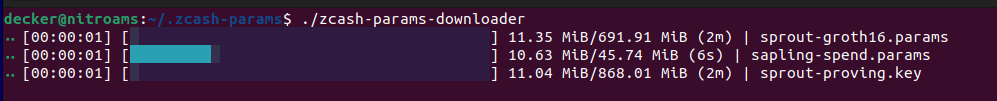

### zcash params downloader

The `zcash params downloader` is a utility, similar to the script `zcutil/fetch-params.sh` used in the Zcash software, that is designed to download the Zcash Params files. These files are essential for the correct operation of the Zcash network and for maintaining transaction privacy and security.

The purpose of this utility is to retrieve the most up-to-date version of the Params files from a trusted source.



It performs the following steps:

1. The utility checks for the existence of the following files in the current directory:

- `sprout-proving.key`
- `sprout-verifying.key`
- `sapling-spend.params`
- `sapling-output.params`
- `sprout-groth16.params`

2. If any of the files from the list (1) are not found, the utility will download them from a trusted source (z.cash) in parallel mode. After the download is finished, it will verify the sha256 checksum of the downloaded file. If a file has already been downloaded and exists, it will only verify its hash without downloading it again. If the hash is incorrect, indicating an incomplete download or other issues, the user should delete the file and restart the utility.

#### Cross-compile for Windows

```
    rustup target add x86_64-pc-windows-gnu
    sudo apt-get install mingw-w64
    cargo build --target x86_64-pc-windows-gnu
```

#### Useful links (dev)

-  https://github.com/search?q=resp.into_body%28%29+download+language%3ARust&type=code&p=2
-  https://github.com/agnes-rs/agnes/blob/22f94409fc20da218a35b9161a9f170280c7481f/src/source/file.rs#L101
-  https://github.com/Byron/git-tool/blob/5f3da85b4f682a12a766dec3c57fc6a3f9f76391/src/update/github.rs#L146
-  https://github.com/k8s-rs/kubernetes-rs/blob/dd29adbab79c58270388010462cc3b4c4f79ac7b/apimachinery/src/client.rs#L112
-  https://github.com/AOSC-Dev/ciel-rs/blob/861b8afe9fd0b972a5331e47f476dbfe676040fb/src/network.rs#L58

-  https://gist.github.com/benkay86/6afffd4cf90ad84ac43e42d59d197e08
-  https://github.com/rgreinho/trauma/blob/0950ca3c54f625fc9b77a35cedd5967deb5c9f42/src/downloader.rs#L92 (!) <- chunks
-  https://github.com/hhatto/rust-snippets/blob/8f188d172ee0e3fcceb21b037d7c4d20919ab1d6/http-client/src/http2-hyper.rs#L87


